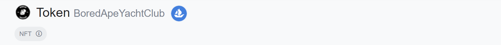

# OpenSea Button

Chrome extension that adds a button on Etherscan and Polygonscan linking to OpenSea  
On token and contract pages it will link to search for the collection  
On address pages it will link to the user account

[`Changelog`](CHANGELOG.md)

# Installation

[`Download`](https://github.com/oe-d/opensea-button/archive/refs/heads/main.zip)

Extract the zip file  
Go to extensions in your browser  
Enable Developer mode  
Click Load unpacked  
Select the opensea-button folder
